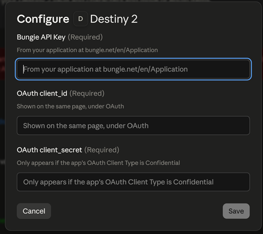
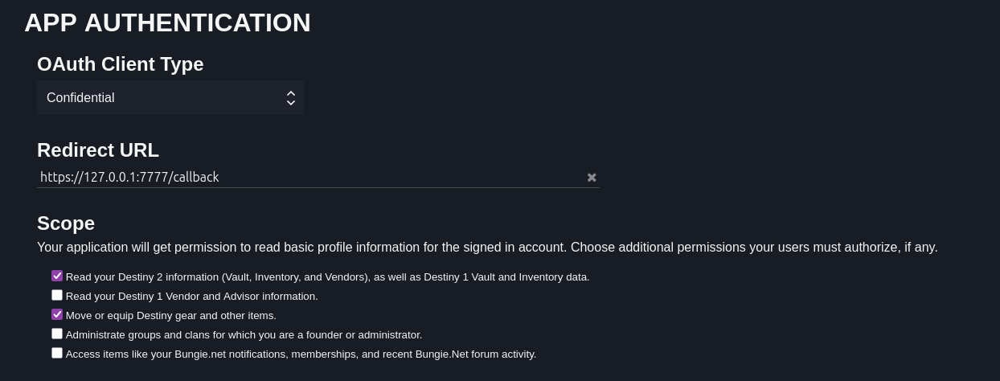
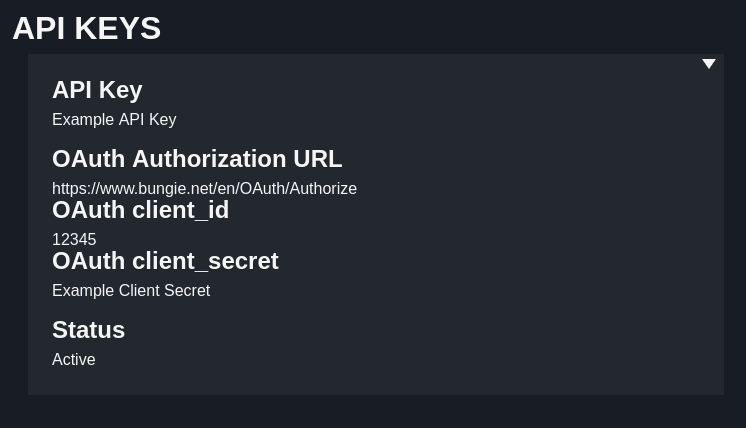
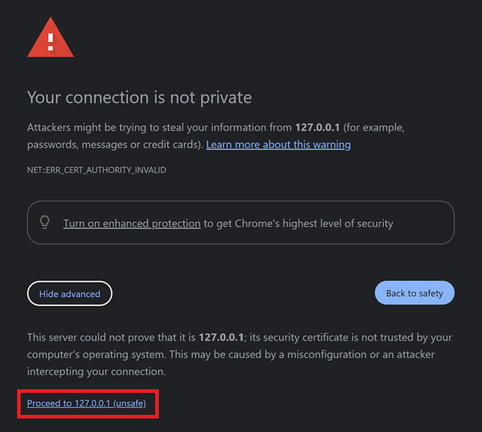

# Destiny Item MCP
Search your vault and move/equip gear in plain english


```
You:    Which of my Fatebringers have Firefly and Explosive Payload?
Claude: You've got exactly one sitting in your Vault, and it's rolled perfectly:
        Fatebringer (Kinetic Hand Cannon)
        Fluted Barrel
        Appended Mag
        Explosive Payload (equipped)
        Firefly (equipped)


You:    Pull it to my titan and equip it
Claude: Sent Multimach CCX to the Vault to make room, pulled Fatebringer onto your 
Titan and equipped it.
```

It reads every weapon and armour piece across your vault and all three characters
with power, stats and the perks *your* copy actually rolled. It can move items
between characters and the vault, pull from the postmaster, and equip on arrival.

## Requirements

- **Claude Desktop** on Windows or macOS. Nothing else to install, Claude supplies
  the runtime the extension needs.
- A **Bungie.net account** with Destiny 2.

Linux isn't supported: Claude Desktop doesn't ship a runtime there. You can still run
it [from source](#building-from-source).

## 1. Install the extension

Download `destiny2-mcp.mcpb` from the
[latest release](https://github.com/KubaKuchniak31415/destiny2-mcp/releases).

In Claude Desktop: **Settings -> Extensions -> Advanced settings -> Install extension…**
and pick the file.

It will ask for three values. Leave that dialog open for now.



## 2. Register a Bungie application

Every user registers their own application. Everything is stored locally on your device.

Go to **https://www.bungie.net/en/Application** and click **Create New App**.

Fill it in exactly like this — three of these four fields will break the extension if
they're wrong, and the errors they produce are not obvious:

| Field | Value |
|---|---|
| **Application Name** | Anything. `My Destiny MCP` is fine |
| **Website** | Anything. Your GitHub profile, or `https://example.com` |
| **OAuth Client Type** | **Confidential** — not Public |
| **Redirect URL** | `https://127.0.0.1:7777/callback` |
| **Scope** | *- Read your Destiny 2 information* <br> *- Move or equip Destiny gear and other items.* |



**Client Type:** Public clients don't get a refresh token, meaning you would have
to reauthenticate every hour. Only Confidential is supported.

**Redirect URL:** it must match character for character, including `https`
and the port.

Save. The page now shows three values:



| On the Bungie page | Goes in the Claude field |
|---|---|
| **API Key** | Bungie API Key |
| **OAuth client_id** | OAuth client_id |
| **OAuth client_secret** | OAuth client_secret |

The client secret only appears once the app is saved as Confidential. If you can't
find it, that setting is why.

Paste all three into Claude, then **fully quit and reopen Claude Desktop**. Check your
system tray and close it from the icon there.

## 3. First run

Ask Claude something like *"what's in my Destiny vault?"*. Three things happen once,
in this order:

**It downloads Destiny's item database.** About 350 MB, unpacked into
`%APPDATA%\destiny2-mcp`. This can take a few minutes on first use and never
happens again until Bungie ships a new season (so never).

**Claude gives you a link to authorise.** Click it, approve access on bungie.net.

**Your browser warns that the connection isn't private.** This is expected, and it is
not a problem. The extension spins up a small web server on your own machine to get the
response from Bungie, and it signs its own certificate to do it. 
Click **Advanced** → **Proceed to 127.0.0.1 (unsafe)**. You'll see "You can close this window",
and you're done. It won't ask again.




Then ask Claude again. From here it just works.

## What it can and can't do

- **Tokens never leave your machine.** They're stored in `%APPDATA%\destiny2-mcp`
  and used only to talk to Bungie.
- **Nothing it does can dismantle an item.** Bungie's API has no dismantle or delete, 
  every move can be undone by moving the item back. This is why it doesn't stop to
  confirm each action.
- **It will move things you didn't explicitly name.** Moving an equipped item equips
  something else first, moving into a full slot sends the lowest-power item there to
  the vault. Both are reported so you can just ask to undo them.

## Troubleshooting

**"Destiny 2 MCP is not configured. Missing: …"**
One or more values didn't reach the extension. Re-enter them in Settings -> Extensions
-> Destiny 2, then fully quit and reopen Claude Desktop (make sure its closed in the
system tray).

**"Your Bungie application is registered as a public OAuth client."**
Set OAuth Client Type to **Confidential** on your app page. A client secret appears
once you save it, paste that into the extension's settings.

**"Timed out waiting for OAuth callback."**
Your app's Redirect URL doesn't match `https://127.0.0.1:7777/callback`, so the
browser never reached the extension. Check it character for character. If it is
correct, something else on your machine may be using port 7777.

**"2108 | AccessNotPermittedByApplicationScope"**
Your app is missing the *Move or equip Destiny gear* scope. Check itthen delete
`%APPDATA%\destiny2-mcp\tokens.json` and authorise again. Scopes are baked into the
token when it's issued, so fixing the app alone changes nothing for the token you
already have.

**Claude says the extension is disconnected.**
Check the log at `%APPDATA%\Claude\logs\mcp-server-destiny2.log`.

## Building from source

Requires Node 24+.

```bash
git clone https://github.com/KubaKuchniak31415/destiny2-mcp.git
cd destiny2-mcp
npm install
cp .env.example .env      # then fill in the three Bungie values
npm start
```

`npm run bundle` produces the `.mcpb`. `npm test`, `npm run lint` and
`npm run typecheck` do what they say.

## Licence

ISC
